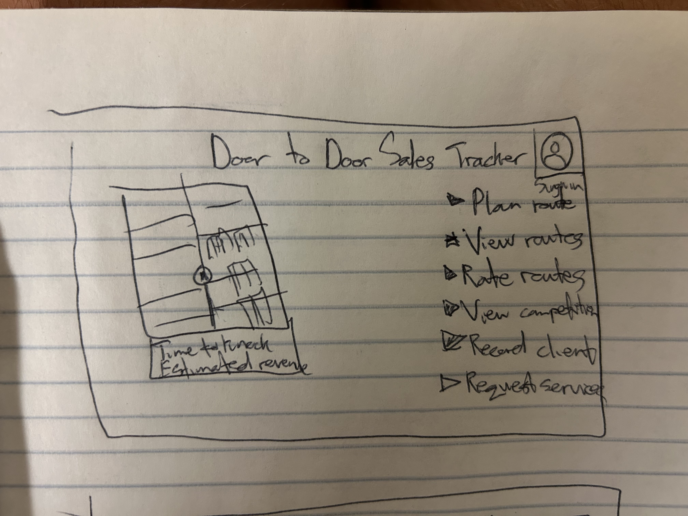
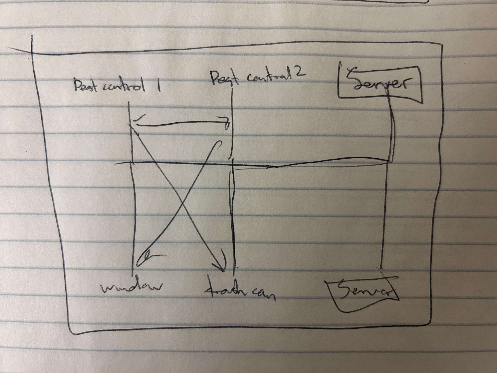

# Door to Door Sales Tracker

[My Notes](sales-notes)

This application will allow users to mark neighborhoods that they've already sold in and record who they have business with and where they live. It will keep their contact information as well as what type of business they are selling so that other sellers can know how saturated certain neighborhoods are with their specific service. I would also like to add a customer view to the app so that they can see who is near them so they can find people to do services they are interested in.

> [!NOTE]
>  This is a template for your startup application. You must modify this `README.md` file for each phase of your development. You only need to fill in the section for each deliverable when that deliverable is submitted in Canvas. Without completing the section for a deliverable, the TA will not know what to look for when grading your submission. Feel free to add additional information to each deliverable description, but make sure you at least have the list of rubric items and a description of what you did for each item.

> [!NOTE]
>  If you are not familiar with Markdown then you should review the [documentation](https://docs.github.com/en/get-started/writing-on-github/getting-started-with-writing-and-formatting-on-github/basic-writing-and-formatting-syntax) before continuing.

## 🚀 Specification Deliverable

> [!NOTE]
>  Fill in this sections as the submission artifact for this deliverable. You can refer to this [example](https://github.com/webprogramming260/startup-example/blob/main/README.md) for inspiration.

For this deliverable I did the following. I checked the box `[x]` and added a description for things I completed.

- [x] Proper use of Markdown
- [x] A concise and compelling elevator pitch
- [x] Description of key features
- [x] Description of how you will use each technology
- [x] One or more rough sketches of your application. Images must be embedded in this file using Markdown image references.

### Elevator pitch

This is the tool for all door to door sellers. It will help keep all of your clients organized in one spot as well as help you plan your routes. Additionally, it will tell you what areas have been knocked recently so that you can avoid conjested neighborhoods and have great success with your sales

### Design

Here is a sequence diagram that shows how to people would interact with the backend to vote.

### Key features

- Individual and secure profiles through HTTPS
- Access to Google Maps to plan routes
- Record neighborhoods that have already been knocked
- Live data of competition in the area to recommend non-competitive neighborhoods
- Keep data of client information and recommend when to reach out to them about providing your services again

### Technologies

I am going to use the required technologies in the following ways:

- **HTML** - One page for login, one page for planning routes, and one page for viewing places you have already traveled to
- **CSS** - Create an interface with different tabs to view each page
- **React** - Provide login, and show how densely populated by salesmen certain neighborhoods are
- **Service** - Backend service with endpoints for
      -Login
      -Rating routes
      -Planning routes
      -Viewing old routes
- **DB/Login** - Data kept of all clients the salesman has business with
- **WebSocket** - As other sellers go to an area, it alerts other salesmen of the competition

## 🚀 AWS deliverable

For this deliverable I did the following. I checked the box `[x]` and added a description for things I completed.

- [x] **Server deployed and accessible with custom domain name** - [My server link](https://jamesross.click).

## 🚀 HTML deliverable

For this deliverable I did the following. I checked the box `[x]` and added a description for things I completed.

- [x] **HTML pages** - I created three pages: `index.html` for the login screen, `map.html` for the main sales route planner, and `about.html` to describe the application.
- [x] **Proper HTML element usage** - I used semantic tags like `<header>`, `<nav>`, `<main>`, and `<footer>` on all three pages to structure the content logically.
- [x] **Links** - The navigation bar in the `<header>` of each page contains links that allow users to move between the Home, Map, and About pages.
- [x] **Text** - Each page has descriptive text, including headings and paragraphs, that explains the purpose of the application and the content on that page.
- [x] **3rd party API placeholder** - On the `map.html` page, I added a placeholder `div` to show where the Google Maps API will be integrated for route planning. 
- [x] **Images** - I added a company logo in the header of each page.
- [x] **Login placeholder** - The `index.html` page contains a form with fields for username and password. After "logging in," the header on the other pages displays a placeholder for the user's name.
- [x] **DB data placeholder** - I included a table on `map.html` with mock data for "Past Routes" and "Client Information" to show where data from the database will eventually be displayed.
- [x] **WebSocket placeholder** - I added a "Live Competition" feed box on the `map.html` page to represent where real-time alerts from other sellers will appear via WebSockets.

## 🚀 CSS deliverable

For this deliverable I did the following. I checked the box `[x]` and added a description for things I completed.

- [ ] **Header, footer, and main content body** - I did not complete this part of the deliverable.
- [ ] **Navigation elements** - I did not complete this part of the deliverable.
- [ ] **Responsive to window resizing** - I did not complete this part of the deliverable.
- [ ] **Application elements** - I did not complete this part of the deliverable.
- [ ] **Application text content** - I did not complete this part of the deliverable.
- [ ] **Application images** - I did not complete this part of the deliverable.

## 🚀 React part 1: Routing deliverable

For this deliverable I did the following. I checked the box `[x]` and added a description for things I completed.

- [ ] **Bundled using Vite** - I did not complete this part of the deliverable.
- [ ] **Components** - I did not complete this part of the deliverable.
- [ ] **Router** - I did not complete this part of the deliverable.

## 🚀 React part 2: Reactivity deliverable

For this deliverable I did the following. I checked the box `[x]` and added a description for things I completed.

- [ ] **All functionality implemented or mocked out** - I did not complete this part of the deliverable.
- [ ] **Hooks** - I did not complete this part of the deliverable.

## 🚀 Service deliverable

For this deliverable I did the following. I checked the box `[x]` and added a description for things I completed.

- [ ] **Node.js/Express HTTP service** - I did not complete this part of the deliverable.
- [ ] **Static middleware for frontend** - I did not complete this part of the deliverable.
- [ ] **Calls to third party endpoints** - I did not complete this part of the deliverable.
- [ ] **Backend service endpoints** - I did not complete this part of the deliverable.
- [ ] **Frontend calls service endpoints** - I did not complete this part of the deliverable.
- [ ] **Supports registration, login, logout, and restricted endpoint** - I did not complete this part of the deliverable.

## 🚀 DB deliverable

For this deliverable I did the following. I checked the box `[x]` and added a description for things I completed.

- [ ] **Stores data in MongoDB** - I did not complete this part of the deliverable.
- [ ] **Stores credentials in MongoDB** - I did not complete this part of the deliverable.

## 🚀 WebSocket deliverable

For this deliverable I did the following. I checked the box `[x]` and added a description for things I completed.

- [ ] **Backend listens for WebSocket connection** - I did not complete this part of the deliverable.
- [ ] **Frontend makes WebSocket connection** - I did not complete this part of the deliverable.
- [ ] **Data sent over WebSocket connection** - I did not complete this part of the deliverable.
- [ ] **WebSocket data displayed** - I did not complete this part of the deliverable.
- [ ] **Application is fully functional** - I did not complete this part of the deliverable.
